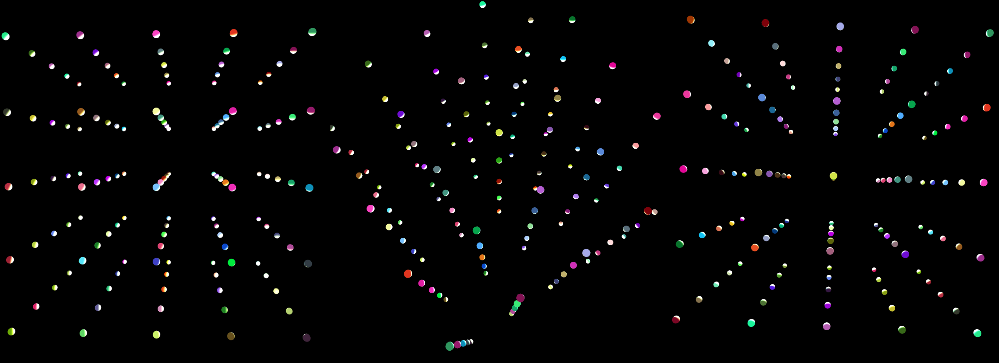

# 3D Cube JS Visualization

 

This project creates a three-dimensional rendering of [an LED cube](http://www.instructables.com/id/Led-Cube-8x8x8/), as shown above.  It serves as a learning platform for programming a physical version!

The visualization is built with [BabylonJS.](https://www.babylonjs.com/)
